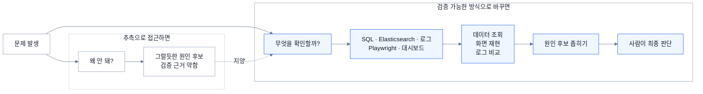
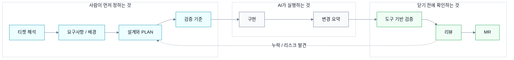
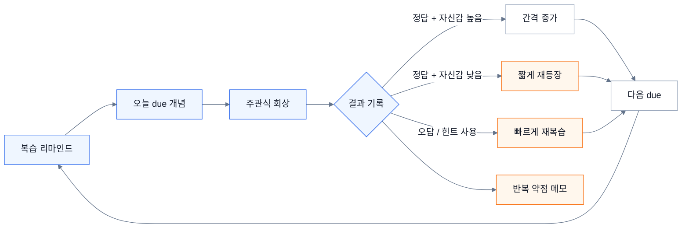

## 들어가며

처음에는 개발자가 AI에게 대체될 수 있다는 말이 무서웠다.

코드를 빠르게 만들고, 익숙하지 않은 영역도 금방 따라오는 걸 보면 완전히 틀린 말은 아닌 것 같았다. 나도 처음에는 AI를 생산성 도구에 가깝게 봤다. 막히는 코드를 물어보고, 보일러플레이트를 만들고, 낯선 코드를 읽을 때 도움을 받는 정도였다.

그런데 실무와 개인 작업에서 AI를 계속 쓰다 보니 생각이 조금 달라졌다.

| 처음 생각 | 계속 써본 뒤 |
|---|---|
| AI가 개발자를 대체할 수도 있겠다 | AI는 내가 어떤 개발자인지 더 선명하게 보여줬다 |
| 생산성 도구에 가깝다 | 강점은 강화하고 약점은 보완하는 동료에 가깝다 |
| 코드를 빨리 만드는 게 핵심이다 | 무엇을 맡기고 어떻게 검증할지가 더 중요했다 |

AI는 나를 대체한다기보다, 내가 어떤 사람인지 더 선명하게 보여주는 쪽에 가까웠다. 내가 원래 잘하던 것은 더 크게 쓰게 만들었고, 약한 부분은 구조적으로 보완하게 만들었다.

지금은 AI를 단순한 자동완성 도구라기보다, 내 강점을 강화하고 약점을 보완하는 동료에 가깝게 본다. 다만 좋은 동료라고 해서 모든 일을 그냥 맡길 수는 없었다. 같이 일하려면 맥락을 줘야 했고, 역할을 나눠야 했고, 결과를 확인할 기준도 필요했다.

이번 글에서는 내가 AI를 어떻게 활용하고 있는지, 왜 그렇게 쓰게 되었는지, 그리고 그 과정에서 내 일하는 방식이 어떻게 바뀌었는지를 정리해보려 한다.

## AI는 내 강점을 강화했다

내 강점은 크게 두 가지에 가깝다.

첫 번째는 납득하고 검증해야 움직이는 성향이다.  
그럴듯한 설명을 들었다고 바로 넘어가기보다, 실제로 동작하는지 확인하고 싶어 한다. 로그를 보고, 데이터를 조회하고, 테스트해보고, 확인한 것과 확인하지 못한 것을 나눠야 마음이 편하다.

두 번째는 뭔가를 만지작거리며 도구로 만들어보는 성향이다.  
반복되는 문제가 있으면 이번 한 번만 해결하고 끝내기보다, 다음에는 덜 헤매도록 작은 도구나 흐름으로 만들어두고 싶어진다.

AI는 이 두 가지 성향을 없애지 않았다. 오히려 더 자주, 더 넓은 범위에 적용하게 만들었다.

| 방향 | 나는 | AI 활용 |
|---|---|---|
| 강점 강화 | 납득하고 검증해야 움직인다 | SQL, 로그, Playwright, 대시보드로 확인 가능한 판을 만든다 |
| 강점 강화 | 반복 문제를 도구로 만들고 싶어 한다 | 티켓 기반 개발 하네스, 트러블슈팅 커맨드로 흐름을 만든다 |
| 약점 보완 | 생각을 밖으로 꺼내는 속도가 느리다 | 문서, 표, 흐름도, 초안으로 산출물화한다 |
| 약점 보완 | 이해가 시간이 지나면 흐려진다 | 리마인드와 주관식 복습 루프로 다시 꺼낸다 |
| 약점 보완 | 선택 이유를 명확히 남기는 데 약하다 | 트레이드오프 질문으로 판단 기준을 문장화한다 |

예전에는 트러블슈팅을 할 때 사람이 직접 로그를 훑고, SQL을 실행하고, 대시보드를 보며 원인을 좁혀갔다. 지금은 AI에게 단순히 “왜 안 돼?”라고 묻지 않는다. 대신 SQL, Elasticsearch, 브라우저 자동화, 로그, 대시보드 같은 관측 도구를 함께 쥐어준다.

그러면 AI는 추측만 하는 것이 아니라 데이터를 조회하고, 화면을 재현하고, 로그를 비교하면서 원인을 좁혀갈 수 있다. 나 역시 AI가 말한 결론을 그대로 믿기보다, 어떤 데이터에서 나온 판단인지 확인한다. 이 방식은 내가 원래 하던 검증 과정을 더 빠르게 반복하게 해줬다.

외부 시스템이나 기기 연동처럼 문서와 실제 동작이 다를 수 있는 영역에서는 더 조심했다. 문서에 적혀 있다고 바로 믿지 않고, 실제 환경에서 확인한 것과 아직 확인하지 못한 것을 나눴다. 실험을 여러 번 반복하면서 성공한 경우와 실패한 경우를 비교했고, 증거 없이 “된다”고 표시하지 않으려 했다.

나중에 보니 이런 방식은 요즘 말하는 Harness에 가까웠다.  
내게 Harness는 거창한 테스트 자동화라기보다, AI가 그럴듯하게 맞는 척하지 못하게 만드는 검증판이었다. 확인한 것과 모르는 것을 나누고, 증거가 없으면 통과시키지 않는 구조에 가까웠다.

개발 과정도 비슷하게 바뀌었다.

티켓을 바로 코드로 바꾸게 하지 않고, 먼저 요구사항과 배경을 정리하고, 설계와 계획을 나눈 뒤, 구현과 리뷰로 이어지는 개발 하네스를 만들었다. AI에게 코드를 빠르게 만들게 하는 것보다, 어디까지 바꿀지와 무엇으로 확인할지를 먼저 정하는 것이 더 중요하다고 느꼈기 때문이다.

이런 흐름은 내가 원래 좋아하던 “만지작거리며 개선하는 습관”을 더 강하게 만들었다. 반복되는 트러블슈팅은 커맨드로 만들고, 자주 보는 로그는 더 잘 볼 수 있게 정리하고, 흩어진 지식은 AI가 참고할 수 있는 문서나 위키 형태로 남기게 되었다.

돌아보면 AI는 내 검증 습관을 대체하지 않았다.  
오히려 검증할 수 있는 판을 더 많이 만들게 했다.

## AI는 내 약점을 보완했다

반대로 AI가 내 약점을 보완해준 부분도 크다.

내 약점 중 하나는 생각이 없다는 게 아니라, 생각을 밖으로 꺼내는 속도가 느리다는 점이었다. 머릿속에는 대략의 방향이 있는데, 그것을 글이나 문서, 표, 흐름으로 꺼내는 데 시간이 오래 걸렸다. 정리만 하다가 실제 산출물로 닫지 못하는 경우도 있었다.

AI는 이 부분을 많이 도와줬다.

요즘은 어떤 내용을 정리할 때 바로 “초안 써줘”라고 하지 않는다. 먼저 독자가 누구인지, 이 글이나 문서의 목적이 무엇인지, 읽고 나서 무엇을 가져가야 하는지부터 묻도록 한다. 그러면 머릿속에 흩어져 있던 생각이 문서의 구조로 내려온다.

복잡한 내용을 이해할 때도 비슷하다. 예전에는 긴 문서를 계속 읽고 밑줄을 치면서 이해하려고 했다. 그런데 텍스트가 쌓일수록 다시 보기 어려워지는 문제가 있었다.

그래서 요즘은 AI에게 설명 방식을 바꿔달라고 자주 요청한다.

> “12살도 이해할 수 있게 설명해줘.”  
> “비유로 다시 풀어줘.”  
> “내가 이해한 내용을 듣고 빈 구멍을 질문해줘.”  
> “이 설명의 반례를 들어줘.”

특히 소크라틱하게 질문을 던지게 하는 방식이 도움이 많이 됐다. AI가 답을 주는 선생님이라기보다, 내가 정말 이해했는지 되묻는 튜터 역할을 하게 만드는 것이다. 이 과정을 거치면 내가 안다고 착각했던 부분이 꽤 자주 드러난다.

복습도 의지에만 맡기지 않으려 했다.

나는 한 번 이해했다고 생각한 내용을 오래 붙잡는 데 약하다. 시간이 지나면 분명 배웠던 내용인데 설명이 흐려지는 경우가 많았다. 그래서 복습 알림을 받고, 그날 다시 볼 개념을 꺼내 주관식으로 떠올리는 구조를 만들었다.

단순히 “봤다 / 안 봤다”를 체크하는 방식은 아니었다. 직접 떠올려보고, 얼마나 확신했는지, 힌트를 썼는지도 함께 기록한다. 맞았지만 자신감이 낮으면 복습 간격이 크게 늘지 않고, 틀리면 금방 다시 나온다. 내가 잘 잊는다는 사실을 인정하고, 기억을 의지가 아니라 구조에 맡긴 셈이다.

트레이드오프를 언어화하는 데도 AI를 자주 쓴다.

개발하다 보면 선택은 한다. 그런데 왜 이 선택을 했는지, 무엇을 포기했는지, 어떤 조건에서는 다른 선택이 나았을지를 명확히 남기지 못할 때가 있다. AI는 이 부분을 계속 되묻게 만든다.

> “다른 선택지는 뭐였지?”  
> “이 선택이 깨지는 조건은?”  
> “성능, 정합성, 복잡도 중 무엇을 포기했지?”  
> “나중에 이 결정을 다시 볼 사람이 이해할 수 있을까?”

이런 질문을 반복하다 보면 감각으로만 남아 있던 판단이 문장으로 내려온다. 설계 문서나 회고를 쓸 때도 결국 중요한 것은 정답을 맞혔다는 사실보다, 그때 어떤 기준으로 선택했는지를 남기는 일이라는 생각이 들었다.

AI는 내 약점을 숨겨주지 않았다.  
오히려 약한 지점을 더 자주 드러내고, 그것을 보완하는 구조를 만들게 했다.

## AI를 쓰며 남은 기준들

AI를 많이 쓰다 보니, 도구 이름보다 오래 남는 기준들이 생겼다.

| 기준 | 내가 이해한 의미 |
|---|---|
| 맥락 | AI가 추측하지 않도록 배경, 제약, 이전 결정을 제공하는 것 |
| 역할 분리 | 구현자와 검증자를 분리해 자기검토로 닫지 않는 것 |
| 확인/미확인 구분 | 실제 확인한 것과 아직 모르는 것을 섞지 않는 것 |
| 루프 | 반복 피드백을 기억이 아니라 다음 작업의 기본값으로 되돌리는 것 |

### 1. 맥락

AI는 맥락이 부족하면 그럴듯하게 틀린다. 요구사항, 제약, 이전 결정, 실패 기록이 없으면 빈칸을 스스로 채운다. 그래서 이제는 질문을 잘 쓰는 것보다, AI가 추측하지 않도록 일의 배경과 제약을 정리하는 일이 더 중요하다고 느낀다.

요즘 자주 보이는 말로는 Context Engineering에 가깝다.  
하지만 내게는 프롬프트를 멋지게 쓰는 기술이라기보다, AI가 판단할 수 있도록 맥락을 쌓아두는 일에 가깝다.

### 2. 역할 분리

한 AI에게 조사, 구현, 리뷰를 모두 맡기면 속도는 빠를 수 있다. 하지만 검증자가 사라진다. 사람이 코드 리뷰를 할 때 작성자와 리뷰어를 나누는 것처럼, AI를 쓸 때도 역할을 나눠야 한다고 느꼈다.

구현하는 역할과 검토하는 역할은 달라야 한다.  
리뷰어는 직접 고치기보다 누락된 리스크를 찾게 하는 편이 낫다. 구조, 보안, 테스트, 정책처럼 관심사가 다르면 보는 기준도 달라져야 한다.

### 3. 확인한 것과 모르는 것 구분

AI가 만든 답변은 꽤 그럴듯하다. 그래서 더 위험할 때가 있다. 내가 실제로 확인한 것인지, 문서에만 있는 것인지, 아직 추측에 가까운 것인지 나눠두지 않으면 어느 순간 모두 “사실”처럼 보인다.

그래서 확인한 환경과 확인하지 못한 환경을 나누고, 실측한 결과와 추정을 구분하려고 한다. 이 선이 있어야 AI가 만든 결론도 어디까지 믿을 수 있는지 판단할 수 있다.

### 4. 루프

한 번 잘 쓰는 것보다, 다음에도 같은 품질이 나오게 만드는 것이 더 중요했다. 같은 피드백을 두 번 받으면 “다음부터 조심해야지”로 끝내지 않으려 한다. 그건 내가 기억을 못 한 문제가 아니라, 시스템이 그 문제를 막지 못한 것에 가깝다고 본다.

그래서 반복되는 피드백은 체크리스트, 문서, 커맨드, 리뷰 기준으로 되돌린다. 피드백을 기억에 남기는 대신 다음 작업의 기본값으로 옮기는 것이다.

이런 기준들이 쌓이면서 AI Native라는 말도 조금 다르게 보이기 시작했다.

처음에는 AI Native라고 하면 어떤 도구를 쓰는지가 먼저 떠올랐다. 하지만 지금은 도구 이름보다, AI가 일할 수 있는 환경을 어떻게 설계하는지가 더 중요하다고 느낀다.

AI를 많이 쓰는 것과 AI가 안전하게 일할 수 있게 만드는 것은 다르다.  
내게 AI Native는 후자에 더 가깝다.

## 마치며

처음에는 개발자가 AI에게 대체될 수 있다는 말이 무서웠다.
지금도 단순히 코드를 빠르게 작성하는 일만 놓고 보면, AI가 많은 부분을 바꾸고 있다는 생각은 든다.

하지만 내가 직접 써보며 느낀 변화는 조금 달랐다.

AI는 나를 지우기보다, 내가 어떤 사람인지 더 선명하게 만들었다.  
납득하고 검증해야 움직이는 성향은 더 넓게 쓰게 했고, 자꾸 만지작거리며 도구로 만들고 싶어 하는 성향은 더 자주 실행하게 했다. 반대로 생각을 밖으로 꺼내는 속도, 이해를 오래 유지하는 힘, 선택의 이유를 언어화하는 부분은 구조적으로 보완하게 만들었다.

그래서 지금은 AI를 얼마나 많이 쓰는가보다, 내 일하는 방식 안에서 어디에 둘지가 더 중요하다고 생각한다.

AI를 잘 쓴다는 건 모든 일을 맡기는 것이 아니었다.  
내가 잘하는 것은 더 크게 쓰고, 약한 부분은 구조로 보완할 수 있게 활용하는 일이었다.

그렇게 쓰다 보니 코드를 덜 쓰게 된 것보다, 더 넓은 문제를 책임질 수 있게 되었다는 감각이 더 크게 남았다.
