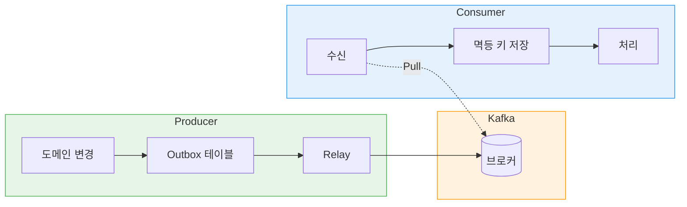

## TL;DR
Kafka 기반 이벤트 파이프라인을 구현하면서, Producer는 Transactional Outbox로 At Least Once 발행을, Consumer는 event_handled 테이블로 멱등 처리를 보장했다.

## 들어가며
### 왜 Kafka인가?
동기 호출은 외부 시스템 장애가 전파되고, 강한 결합을 만든다. Kafka를 통해 Producer와 Consumer를 분리하면, 각 시스템이 독립적으로 장애를 처리하고 확장할 수 있다.

### 이번 주 구현 범위
commerce-api(Producer)에서 좋아요/재고 소진/주문 이벤트를 발행하고, commerce-streamer(Consumer)에서 이를 수신해 product_metrics 집계와 캐시 무효화를 수행한다.

## Kafka 기본 개념

| 개념 | 설명 |
|------|------|
| **Push vs Pull** | Producer는 Kafka에 Push, Consumer는 Kafka에서 Pull. Pull 방식 덕분에 Consumer가 자기 속도로 처리하고, 장애 시 offset을 되감아 재처리 가능 |
| **Topic** | 메시지의 논리적 채널 |
| **Partition** | Topic을 물리적으로 나눈 단위. 같은 Partition Key를 가진 메시지는 같은 Partition으로 들어가 순서 보장 |
| **Consumer Group** | 같은 Group의 Consumer들이 Partition을 나눠 가짐. 한 Partition은 Group 내 하나의 Consumer만 읽음 |

### 주요 설정값
`acks=all`은 모든 replica에 기록될 때까지 대기하고, `enable.idempotence=true`는 Producer 재시도 시 중복 메시지를 방지한다. `auto.offset.reset`은 Consumer가 처음 시작하거나 offset이 없을 때 어디서부터 읽을지 결정한다. 이 설정들을 조합해 "메시지 유실 없이(At Least Once), 중복 발행도 최소화"하는 Producer를 만든다.

## Producer: At Least Once 보장
### Transactional Outbox 패턴
DB와 Kafka는 서로 다른 시스템이라, "DB 저장 + Kafka 발행"을 하나의 트랜잭션으로 묶을 수 없다. DB는 성공했는데 Kafka가 실패하면 이벤트가 유실되고, 반대면 거짓 이벤트가 나간다.

Outbox 패턴은 이 문제를 우회한다. "이벤트를 보내야 한다"는 사실을 outbox 테이블에 먼저 기록하고, 별도 프로세스가 이 테이블을 읽어 Kafka로 보낸다. DB 저장과 outbox 기록은 같은 DB니까 하나의 트랜잭션으로 묶을 수 있다.

Kafka 발행이 실패해도 outbox에 기록이 남아있으니 재시도할 수 있다. 결국 "DB에 저장된 이벤트는 반드시 Kafka로 나간다"를 보장한다.

### Outbox 테이블 구조
status(NEW/SENDING/SENT/DEAD), retry_count, next_retry_at 컬럼으로 발행 상태와 재시도를 관리한다. 발행 실패 시 retry_count를 증가시키고, 최대 재시도 초과 시 DEAD로 전환해 수동 처리한다.

### Relay 폴링 vs 즉시 발행
기본은 @Scheduled 폴링(200ms)으로 outbox를 읽어 발행한다. 주문/결제처럼 실시간성이 중요한 이벤트는 @TransactionalEventListener(AFTER_COMMIT)에서 즉시 발행을 시도하고, 실패하면 폴링이 회복한다.

### 상태 기반 조회 후 UPDATE
여러 인스턴스가 같은 outbox row를 중복 발행하지 않도록, NEW → SENDING으로 상태를 먼저 변경(선점)한 뒤 발행한다. 프로세스 크래시로 SENDING에 고착되면, lease 만료(next_retry_at) 후 NEW로 되돌려 재시도한다.

## Consumer: 멱등 처리
### 왜 멱등 처리가 필요한가?
Producer가 idempotence=true여도, Consumer 리밸런싱이나 네트워크 이슈로 같은 메시지가 여러 번 전달될 수 있다. Kafka는 At Least Once delivery를 보장하므로, Consumer에서 effect가 1번만 반영되도록 멱등 처리가 필요하다.

### event_handled 테이블
event_id를 PK로 하는 테이블에 처리한 이벤트를 기록한다. 같은 event_id가 또 오면 INSERT 시 PK 제약 위반으로 스킵한다.

### 최신 이벤트만 반영
상태성 이벤트(재고 소진 등)는 순서가 뒤바뀌어 도착할 수 있다. occurredAt(Producer 발행 시각)을 저장해두고, 새 이벤트의 occurredAt이 더 과거면 무시한다.

### manual Ack
auto commit을 끄고, DB 트랜잭션이 성공한 후에만 acknowledge()를 호출한다. 처리 중 실패하면 ack하지 않아 Kafka가 재전달한다.

## 과제에서 배운 것들
### Outbox 설계 결정
eventId는 UUID v4로 생성했다. ULID 같은 정렬 가능한 ID도 있지만, 이번 범위에서는 정렬/최근 조회 목적이 없어 단순한 UUID로 충분했다. topic 컬럼을 outbox에 저장한 이유는, 발행 시점에 라우팅 로직이 변경되더라도 저장된 row는 원래 의도대로 발행되게 하기 위함이다.

### 멱등 처리 구현 결정
event_handled 존재 여부를 먼저 체크하지 않고, 바로 INSERT 후 DataIntegrityViolationException을 catch한다. 리밸런싱 중 두 Consumer가 동시에 같은 메시지를 처리할 때, 체크 후 INSERT 방식은 race condition이 생기기 때문이다. event_handled(멱등)와 event_log(감사/분석)를 분리한 이유는 보관 정책과 쿼리 패턴이 다르기 때문이다.

### occurredAt 비교
Consumer 처리 시각(now)이 아니라 Producer 발행 시각(occurredAt)을 저장/비교한다. Consumer lag이나 재시도로 now는 뒤섞이지만, occurredAt은 이벤트 발생 순서를 반영한다.

### 캐시 evict는 중복 이벤트에서도 수행
event_handled에 이미 있어도 OUT_OF_STOCK 이벤트는 캐시 evict를 수행한다. evict는 DB 트랜잭션 밖의 외부 부작용이라, event_handled INSERT 성공 후 evict 전에 크래시하면 캐시가 영구히 stale해질 수 있다.

### 설정 외부화
Partition Key는 prefix 없이 raw id(예: "123")만 사용했다. 토픽 이름만으로 key 의미를 예측할 수 있게 네이밍했다. auto.offset.reset은 earliest를 선택해 유실을 방지하고, 중복은 event_handled로 흡수한다.

## 고민했던 것들
### 이벤트 계약(EventType) 공유 방식
commerce-api와 commerce-streamer가 같은 이벤트 타입을 써야 하는데, 공유 모듈로 묶으면 결합도가 높아지고, 각자 관리하면 동기화가 어렵다.

```java
// commerce-api (Producer)
enum EventType {
    PRODUCT_LIKED("product_liked", "catalog-events"),
    PRODUCT_SOLD("product_sold", "catalog-events"),
    ...
}

// commerce-streamer (Consumer)
enum EventType {
    PRODUCT_LIKED("product_liked"),
    PRODUCT_SOLD("product_sold"),
    ...
}
```

이번에는 각 앱에서 Enum을 따로 관리했다. 이벤트가 늘어나면 공유 모듈이나 Schema Registry를 고려가 필요할 듯 하다.

### 이벤트에 payload를 담는게 적절한가?
대부분의 이벤트는 "발생 사실"만으로 충분한데(LIKED → +1), PRODUCT_SOLD는 quantity가 필요하다.

제로 페이로드 방식을 쓰면 Consumer가 Producer DB를 한번 더 조회해야 한다. 이러면 복잡도와 유지보수 포인트가 늘어난다고 판단해서, 이벤트에 payload를 담기로 했다.

```java
// DomainEvent 인터페이스
default Map<String, Object> payload() {
    return Map.of();  // 기본값: 빈 Map
}

// ProductSoldEvent - 필요한 데이터만 payload에 포함
@Override
public Map<String, Object> payload() {
    return Map.of("quantity", quantity, "orderId", orderId);
}
```

### event_handled와 event_log를 왜 분리했나?
event_handled는 멱등성 체크용이고, event_log는 감사/분석용이다. 목적이 다르면 보관 정책과 쿼리 패턴도 달라진다.

event_handled는 "이 이벤트 처리했나?"만 확인하면 되니까 event_id를 PK로 두고, 일정 기간 후 삭제해도 된다. event_log는 히스토리 보존이 핵심이라 append-only로 오래 보관하고, 날짜 기준 조회가 필요하다.

한 테이블로 합치면 "처리 완료된 건지, 지금 처리해야 하는 건지" 구분 로직이 추가되고, 보관 정책도 꼬인다. 역할이 다르면 테이블도 분리하는 게 단순하다.

## 운영 시 고려사항
Kafka를 운영 환경에 적용할 때 다음 설정들을 고려하면 좋다.

### Replication Factor
replica 수를 늘리면 broker 장애 시에도 데이터가 유실되지 않는다. 다만 acks=all 설정 시 모든 replica 응답을 기다려 지연이 늘어난다. 보통 운영 환경에서는 RF=3을 권장하고, 개발 환경에서는 RF=1로 단순하게 가기도 한다.

### Partition 개수
Partition 수가 Consumer 병렬성의 상한이다. 한 Partition은 한 Consumer만 읽을 수 있어서, Consumer를 아무리 늘려도 Partition 수 이상으로 병렬 처리가 안 된다. 너무 적으면 확장이 막히고, 너무 많으면 리밸런싱 비용이 커진다. 예상 throughput과 Consumer 수를 고려해서 정해야 한다.

### Retention 불일치 리스크
Kafka 로그 보관(log.retention)과 Consumer offset 보관(offsets.retention)이 다르면, offset은 있는데 메시지는 삭제된 상황이 생긴다. 이때 auto.offset.reset 설정에 따라 동작이 달라진다. earliest면 처음부터 재처리(중복 발생 가능), latest면 유실이 발생한다.
이번 프로젝트에서는 유실 방지를 우선해서 earliest를 선택했고, 중복 메시지는 event_handled 테이블의 멱등 처리로 흡수한다.

## 마무리
이번 주차는 Kafka로 느슨한 결합 구조를 어떻게 만드는지에 집중했다. Producer는 Outbox 패턴으로 "반드시 발행"을 보장하고, Consumer는 멱등 키로 "중복 처리 방지"를 보장하는 구조를 직접 구현해봤다.

Kafka가 왜 Consumer Pull 방식인지, 그래서 재시도와 재처리가 어떻게 가능한지도 이해하게 됐다. 막연했던 Kafka가 조금은 손에 잡히는 느낌이다.
