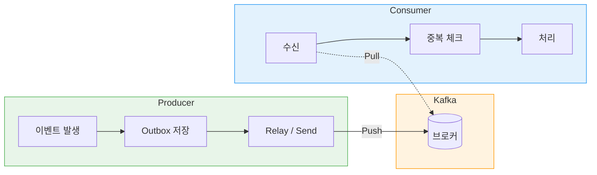
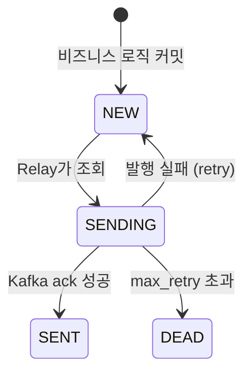
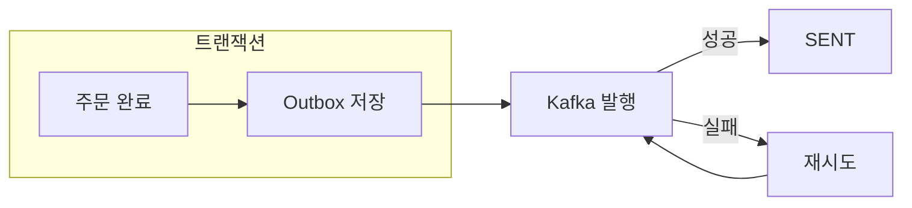

## TL;DR
1. 실패해도 복구 가능한 구조가 중요하다.
2. Producer: Outbox 테이블에 먼저 저장 → Kafka 발행 실패해도 재발행 가능
3. Consumer: 멱등 키로 중복 방지 → 같은 메시지가 여러 번 와도 1번만 처리

## 들어가며

주문이 완료되면 쿠폰 서비스에 "쿠폰 사용" 이벤트를 보낸다.
그런데 네트워크 순단으로 이벤트가 갑자기 사라졌다면 어떻게 될까?

쿠폰 사용 이벤트를 기록하지 않았기 때문에 뭘 다시 보내야 하는지조차 알 수 없다.
이제 사용자는 쿠폰을 사용하지 않고 물건을 구매하게 되었고, 개발자는 어디로 갔는지 모를 이벤트를 찾아 야근을 하게 된다.

이 글은 Kafka와 Outbox 패턴으로 이벤트 유실에도 복구할 수 있는 구조를 만든 과정이다.

### Kafka란?

Kafka란 무엇일까?
> 여러 서비스에서 실시간으로 쏟아지는
> 이벤트들을 한 곳에 모아서, 안전하게 저장해 두고,
> 다른 서비스들이 필요할 때 빠르게 가져가 쓰게 해주는
> 고속 데이터 전달·저장 시스템이다

쉽게 표현하면 Kafka는 서비스 간에 이벤트를 전달하는 메시지 브로커다.
이벤트를 디스크에 저장하기 때문에, 장애가 나도 저장된 지점부터 다시 읽을 수 있다.
Producer(발행자)와 Consumer(소비자)가 직접 연결되지 않아서 서로 독립적으로 동작한다.



## Broker (Kafka)

우선 가장 중요한 Kafka가 어떻게 동작하는지부터 살펴보자.

### 기본 개념

#### Push vs Pull

Producer는 Kafka에 메시지를 Push하고, Consumer는 Kafka에서 Pull한다. Pull 방식이라 Consumer가 자기 속도로 처리할 수 있다. 처리가 끝나면 offset을 커밋해서 "여기까지 읽었다"를 기록하는데, 장애 시 커밋하지 않으면 offset이 그대로 남아있어서 같은 지점부터 다시 읽을 수 있다.

#### Topic과 Partition

Topic은 메시지의 논리적 채널이고, Partition은 Topic을 물리적으로 나눈 단위다. 같은 Partition Key를 가진 메시지는 같은 Partition으로 들어가서 순서가 보장된다.

#### Consumer Group

Topic의 Partition들을 같은 Group의 Consumer들이 나눠서 읽는다. 한 Partition은 한 Consumer만 담당하므로, Consumer를 늘려도 Partition 수 이상으로는 병렬 처리가 안 된다.

예를 들어:

| Partition | Consumer | 동작 |
|-----------|----------|------|
| 3개 | 3개 | 각각 1개씩 담당 |
| 3개 | 5개 | 3개만 일하고 2개는 대기 |
| 3개 | 2개 | 한 Consumer가 2개 담당 |

### Kafka 설정
Kafka에서 메시지를 안정적으로 처리하기 위해 몇 가지 설정을 알아두면 좋다.

#### `acks` (응답 대기 수준, 기본값 1)

Producer가 메시지 전송 후 몇 개의 replica 응답을 기다릴지 설정한다. `all`로 변경하면 leader와 모든 ISR(In-Sync Replicas)이 기록을 확인한 뒤 응답하므로, 장애 시에도 유실되지 않는다. 단, 응답이 느려진다.

| acks | 응답 조건 | 장점 | 단점 |
|------|----------|------|------|
| 0 | 응답 안 기다림 | 가장 빠름 | 유실 가능성 높음 |
| 1 | Leader만 기록 | 빠름 | Leader 죽으면 유실 |
| all | 모든 ISR 기록 | 유실 없음 | 느림 |

기본값은 `1`이다. 이번 프로젝트에서는 이벤트 유실을 막기 위해 `all`을 선택했다.

#### `enable.idempotence` (멱등성 보장, 기본값 true)

Producer → Kafka 구간에서 재시도 시 중복 메시지 발행을 방지한다. 단, Kafka → Consumer 구간은 보장하지 못한다. Consumer가 메시지 처리 후 offset 커밋 전에 리밸런싱이나 죽어버리면, 재시작 시 같은 메시지를 다시 받을 수 있다.

#### `auto.offset.reset` (시작 위치, 기본값 latest)

Consumer가 처음 시작하거나 offset이 없을 때 어디서부터 읽을지 결정한다. earliest면 처음부터 재처리(중복 가능), latest면 유실 가능. 이번 프로젝트에서는 유실 방지를 우선해서 earliest를 선택했고, 중복은 멱등하게 처리한다.


## Producer: At-least-once 보장

### Transactional Outbox 패턴
DB와 Kafka는 서로 다른 시스템이라 하나의 트랜잭션으로 묶을 수 없다.
DB는 성공했는데 Kafka 발행이 실패하면 이벤트가 유실된다.
그래서 "보낼 이벤트"를 Outbox 테이블에 먼저 저장하고, 스케줄러나 즉시 발행으로 Kafka에 보낸다.
이제 메시지 전송이 실패해도 Outbox에 남아있으니 재발행할 수 있다.

### Outbox 테이블 구조

```sql
CREATE TABLE outbox_event (
    id BIGINT PRIMARY KEY AUTO_INCREMENT,
    event_id VARCHAR(36) NOT NULL UNIQUE,     -- UUID v4, 멱등 키로 사용
    event_type VARCHAR(50) NOT NULL,          -- PRODUCT_LIKED, PRODUCT_SOLD 등
    aggregate_id VARCHAR(50) NOT NULL,        -- Partition Key (productId 등)
    topic VARCHAR(100) NOT NULL,              -- 발행할 토픽 (저장 시점에 고정)
    payload JSON,                             -- 이벤트 데이터
    status VARCHAR(20) NOT NULL,              -- NEW → SENDING → SENT / DEAD
    retry_count INT DEFAULT 0,                -- 재시도 횟수
    next_retry_at DATETIME,                   -- 다음 재시도 시각 (lease 만료 판단)
    created_at DATETIME NOT NULL
);
```

`event_id`는 이벤트마다 고유한 UUID로 생성한다. Consumer가 이 ID로 "이미 처리한 이벤트인지" 판단해서 좋아요 중복 집계나 재고 중복 차감 같은 문제를 방지한다.

### Outbox 상태 전이



| 상태 | 의미 | 다음 행동 |
|------|------|----------|
| NEW | 아직 발행 시도 안 함 | Relay가 조회해서 발행 |
| SENDING | 발행 진행 중 | Kafka ack 대기 |
| SENT | 발행 완료 | 끝 |
| DEAD | 재시도 한계 초과 | 수동 조치, 알림 |

### 이벤트 발행 흐름



주문/결제처럼 실시간성이 중요한 이벤트는 AFTER_COMMIT에서 즉시 발행을 시도하고, 실패하면 폴링으로 복구한다.

## Consumer: 멱등 처리

### 왜 멱등 처리가 필요한가?
Producer가 중복 발행을 방지하였더라도 Consumer에게 같은 메시지가 여러 번 전달될 수 있다.
그래서 Consumer에서는 같은 이벤트가 여러 번 와도 1번만 처리되도록 멱등 처리가 필요하다.

**event_handled 테이블**

```sql
CREATE TABLE event_handled (
    event_id VARCHAR(36) PRIMARY KEY,  -- Producer가 발행한 UUID
    handled_at DATETIME NOT NULL       -- 처리 시각
);
```

처리한 이벤트를 기록하고, 같은 event_id가 또 오면 PK 제약 위반으로 스킵한다.

```java
try {
    eventHandledRepository.save(EventHandled.of(eventId, now));
} catch (DataIntegrityViolationException e) {
    return true;  // 이미 처리된 이벤트, 스킵
}
// 실제 비즈니스 로직 수행
```

존재 여부를 먼저 체크하지 않고 바로 INSERT 후 예외를 catch한다. PK 제약이 원자적으로 중복을 막아주고, 대부분 첫 처리라 한 번의 DB 호출로 끝난다.

### 이벤트 처리 전략: 상태 동기화 vs 이벤트 집계

이벤트 처리 방식은 **비즈니스 요구사항**에 따라 달라진다.

#### 상태 동기화 (State Sync)
"현재 상태"만 중요한 경우다. 예를 들어 상품 정보 변경, 사용자 프로필 업데이트 등이 해당한다.
이벤트가 순서대로 도착하지 않을 수 있으므로, Producer 발행 시각(occurredAt)을 비교해서 더 최신인 이벤트만 반영한다.

```sql
UPDATE product_cache
SET name = :name, updated_at = GREATEST(updated_at, :occurredAt)
WHERE id = :id AND updated_at < :occurredAt
```

#### 이벤트 집계 (Event Aggregation)
"모든 이벤트의 누적"이 중요한 경우다. 좋아요 수, 조회수, 재고 차감 등이 해당한다.

좋아요를 예로 들면, 사용자가 좋아요 → 취소 → 다시 좋아요를 했을 때:
- 상태 동기화 방식: 마지막 상태(좋아요)만 반영 → 이미 +1인 상태에서 또 +1 → **오류**
- 이벤트 집계 방식: +1, -1, +1 순서대로 처리 → **정확한 집계**

```java
switch (event.getType()) {
    case LIKED -> count.incrementAndGet();
    case UNLIKED -> count.updateAndGet(c -> Math.max(0, c - 1)); // 음수 방지
}
```

> 이벤트 집계에서도 순서 역전은 발생할 수 있다. UNLIKED가 먼저 도착하면 음수가 될 수 있으므로, 비즈니스 로직으로 방어해야 한다.

| 구분 | 상태 동기화 | 이벤트 집계 |
|------|------------|------------|
| 관심사 | 최종 상태 | 모든 변화량 |
| 예시 | 상품 정보 변경 | 좋아요 수, 재고 |
| 순서 역전 | occurredAt 비교로 무시 | 비즈니스 로직으로 방어 |
| 멱등성 | 자연스럽게 보장됨 | event_id 중복 방지 필수 |

### Manual Ack
Consumer는 메시지를 어디까지 읽었는지 `offset`으로 기록한다. `auto commit`이 켜져 있으면 메시지를 받자마자 `offset`이 커밋된다.

문제는 처리 중 실패할 때다. `offset`은 이미 올라갔으니 Kafka는 "처리 완료"로 보고, 재시작해도 그 메시지를 다시 주지 않는다. 유실이다.

그래서 `auto commit`을 끄고, 비즈니스 로직 성공 후에만 수동으로 `ack`한다. 실패하면 `offset`이 올라가지 않아서 Kafka가 재전달해준다.

```java
if (processed) {
    acknowledgment.acknowledge();
}
// 실패하면 `ack` 안 함 → `offset` 안 올라감 → Kafka가 재전달
```

## 마무리

이번 주차의 핵심은 Kafka 사용법인가 싶었는데, 진행해보니 "메시지 발행이 실패했을 때 어떻게 다시 처리할 것인가"를 생각해보라는 주차로 느껴졌다.
모험가의 여정처럼 이벤트의 여정도 험난하다. 네트워크 장애, 서버 다운, 타임아웃 등 온갖 풍파를 만난다.
메시지 혹은 시스템도 "실패해도 다시 시도할 수 있게" 만들어 주는 것이 중요하다고 느끼는 요즘이다.

| 실패 시나리오 | 복구 방법 |
|--------------|----------|
| Kafka 발행 실패 | Outbox에서 재발행 |
| Consumer 처리 중 죽음 | offset 미커밋 → 재전달 |
| 중복 메시지 | event_handled PK로 스킵 |

이렇게 대용량 트래픽을 처리할 때 거의 필수로 사용되는 카프카의 아주 일부분을 살짝 맛보았다. 어렵다 어려워!
