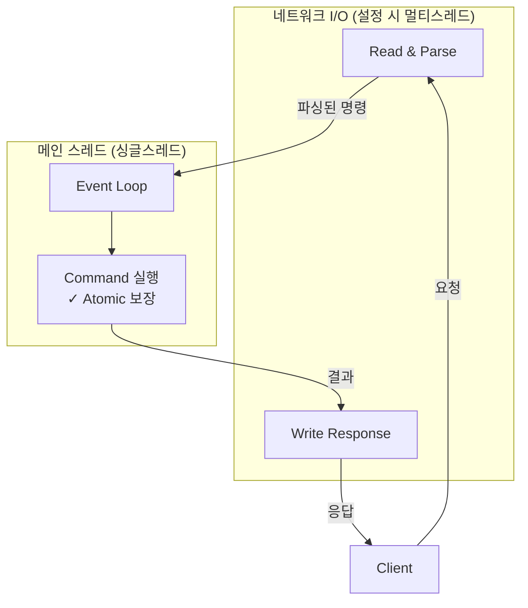

## 1. 들어가며

실무에서 Redis를 캐시, 분산락으로 사용하고 있다. 그리고 현재 진행하고 있는 이커머스 프로젝트에 랭킹 기능을 추가하면서 Redis ZSet 자료구조를 활용하였다.
다양한 Redis 기능을 가져다 쓰고 있지만, 정작 "Redis"가 어떤 문제를 해결하기 위해 만들어졌고, 어떻게 문제를 해결했는지 깊게 생각해본 적은 없었다.
이번 글에서는 많은 개발자들이 사용하고 있는 Redis가 만들어진 이유와 동작 원리에 대해 학습한 내용을 정리하였다.

## 2. Redis는 왜 만들어졌을까

2007년, 이탈리아 개발자 살바토레 산필리포는 **LLOOGG**라는 서비스를 운영하고 있었다. 웹사이트 방문자의 행동을 **실시간**으로 보여주는 로그 분석기였다.

**트래픽이 늘면서** 문제가 발생하였다.

페이지뷰마다 DB에 쓰기가 발생하고, 방문자 활동을 실시간으로 보여줘야 했다. MySQL은 이 두 가지를 동시에 감당하지 못했다.

### 그래서 뭐가 필요했을까?

문제를 해결하려면 **빠른 쓰기**와 **"최근 N개" 빠른 조회**가 필요했다.

하지만 LLOOGG에 사용했던 MySQL은 디스크 기반이라 속도에 한계가 있었다. 디스크는 데이터를 읽고 쓸 때마다 헤드가 이동하고 플래터가 회전해야 한다. 초당 수천 건을 실시간으로 처리하기엔 너무 느렸다.

그래서 산필리포는 인메모리 키-값 저장소 **Redis**(Remote Dictionary Server)를 직접 만들었다.

메모리는 물리적 이동 없이 주소만 알면 바로 접근할 수 있어서 디스크보다 수만 배 빠르다. 덕분에 빠른 쓰기와 빠른 조회 문제를 해결할 수 있었다.

[MySQL을 걷어내고 Redis로 교체한 뒤, 5년간 **20억 페이지뷰**를 월 $150짜리 VM 하나로 처리했다고 전해진다](https://blog.brachiosoft.com/en/posts/redis/).

## 3. Redis는 어떻게 문제를 해결했을까

Redis는 "빠른 쓰기"와 "최근 N개 빠른 조회" 문제를 어떻게 해결했을까?


### 3-1. 인메모리

앞서 디스크의 한계를 살펴봤다. 그렇다면 메모리는 뭐가 다를까?

컴퓨터의 저장소는 계층 구조로 되어 있다. CPU에 가까울수록 빠르고, 멀수록 느리다.

| 계층 | 속도 | 용량 |
|-----|------|-----|
| CPU 레지스터 | 가장 빠름 | 가장 작음 |
| L1/L2/L3 캐시 | ↓ | ↓ |
| **RAM (메모리)** | ↓ | ↓ |
| SSD/HDD (디스크) | 가장 느림 | 가장 큼 |

디스크는 **집에 두고 온 물건**이다. 필요할 때마다 집까지 다녀와야 한다.
메모리는 **주머니에 있는 물건**이다. 필요하면 바로 꺼내면 된다.

Redis는 데이터를 디스크가 아닌 메모리에 저장한다. 결과적으로 디스크보다 **수천 배에서 수만 배** 빠른 속도를 낼 수 있다.

### 3-2. 단순한 Key-Value + 효율적인 자료구조

**빠른 쓰기: Key-Value의 단순함**

RDBMS는 테이블 스키마, 인덱스 갱신, 트랜잭션 로그 등 여러 단계를 거친다. Redis는 단순하다. Key를 주면 Value를 저장하고, 해시테이블 기반이라 `O(1)` 상수 시간에 처리된다.

**최근 N개 빠른 조회: ZSet(Sorted Set)**

| | RDBMS | Redis ZSet |
|---|-------|------------|
| 쿼리 | `ORDER BY timestamp DESC LIMIT N` | `ZREVRANGE key 0 N-1` |
| 동작 | 쿼리 파싱 → 옵티마이저 → B-Tree 탐색 | 스킵리스트에서 바로 조회 |
| 복잡도 | 인덱스 타도 여러 단계 | `O(log N + M)` |
| I/O | 디스크 접근 필요 | 메모리에서 바로 반환 |

ZSet은 각 요소에 score(예: 타임스탬프)를 부여하면 **삽입 시점에 이미 정렬**된다. 내부적으로 스킵리스트를 사용해서 삽입/삭제는 `O(log N)`, 범위 조회는 `O(log N + M)`이다. (시작 위치 찾는 데 `O(log N)`, M개 순회에 `O(M)`)

### 3-3. 싱글스레드 + I/O 멀티플렉싱

인메모리와 효율적인 자료구조 외에, Redis는 싱글스레드라는 설계를 선택했다. 공식 문서에서는 이렇게 설명한다:

> "Redis uses a mostly single threaded design"

**"mostly"라고?**

완전한 싱글스레드는 아니다. 어떤 부분이 싱글스레드이고, 어떤 부분이 아닌지 살펴보자.

| 구분 | 처리 방식 |
|------|-----------|
| **명령어 실행** | 싱글스레드 (메인 이벤트 루프) |
| **I/O 읽기/쓰기** | 멀티스레드 (Redis 6.0+, 설정 시) |
| **BGSAVE, AOF 재작성** | 자식 프로세스 (fork) |
| **UNLINK 등 비동기 삭제** | 백그라운드 스레드 |

핵심인 **명령어 실행은 싱글스레드**다. I/O나 백업 같은 부가 작업만 별도로 처리한다.

**왜 명령어 실행을 싱글스레드로 할까?**

멀티스레드는 락 경쟁, 컨텍스트 스위칭 오버헤드가 생긴다. Redis 명령은 대부분 가벼워서 CPU가 병목이 아니다. 오히려 싱글스레드로 설계하면 락 없이도 `INCR`, `DECR` 같은 연산이 원자적으로 보장된다.

**그럼 동시 요청은?**

I/O 멀티플렉싱(`epoll`)을 사용한다.

Spring MVC의 Servlet 모델은 요청마다 스레드를 할당한다. 10,000개 동시 요청이 오면 10,000개 스레드가 필요하고, 메모리와 컨텍스트 스위칭 비용이 커진다.

`epoll`은 다르다. Linux에서 제공하는 I/O 이벤트 알림 메커니즘으로, 하나의 스레드가 수천 개의 연결(소켓)을 감시한다. 마치 한 명의 웨이터가 여러 테이블을 보다가 손 든 테이블만 응대하는 것과 같다. 



Redis 6.0부터 네트워크 읽기/쓰기를 멀티스레드로 처리할 수 있다 (기본은 비활성화). 설정하면 처리량이 향상되지만, 명령 실행은 여전히 싱글스레드라서 Atomic이 보장된다.

## 4. 고려해야 할 점

### 4-1. 블로킹 명령어

하나의 명령어가 오래 걸리면 어떻게 될까?
1억개의 키가 있을 때 `KEYS *` 같은 O(N) 명령어를 사용하면 1억개를 읽을 때까지 다른 모든 요청이 대기하게 된다. 그래서 `SCAN` 같은 점진적 명령어를 사용해야 한다.

```bash
redis-cli KEYS "user:*"                    # 1억 개의 키가 있으면 1억 개를 다 훑는다
redis-cli SCAN 0 MATCH "user:*" COUNT 100  # 커서 기반으로 100개씩 나눠서 조회한다.
```

### 4-2. 데이터 영속성

메모리 기반이라 별도 설정 없이는 서버 재시작 시 데이터가 사라진다. Redis는 이를 보완하는 두 가지 영속성 옵션을 제공한다:

- **RDB**: 특정 시점의 스냅샷을 디스크에 저장 (BGSAVE)
- **AOF**: 모든 쓰기 명령어를 로그로 기록

백업 작업은 메인 스레드에서 처리하면 전체가 멈추기 때문에, Redis는 `fork()`로 자식 프로세스를 생성해서 처리한다. Copy-on-Write 덕분에 자식 프로세스가 백업하는 동안 메인 스레드는 계속 명령어를 처리할 수 있다.

### 4-3. 메모리 관리

메모리는 디스크보다 비싸고 용량이 제한적이다. 그래서 일반적으로 시스템 메모리의 **50~80%** 범위 내에서 관리하는 것이 권장된다.

또한 Redis는 데이터를 추가/삭제하다 보면 메모리가 조각나는 **파편화(fragmentation)** 문제가 있다. 실제 사용량보다 더 많은 메모리를 점유하게 되므로 여유 공간이 필요하다.

`maxmemory` 설정으로 상한을 걸고, 초과 시 eviction 정책(LRU, LFU 등)에 따라 오래된 키를 삭제하도록 설정할 수 있다.

## 5. 본질과 실무 연결해보기

앞서 살펴본 Redis의 동작 원리를 실무에서 마주칠 수 있는 궁금증과 연결해보자.

| 고민점 | 왜? (본질과 연결) |
|-------|------------------|
| Redis가 락처럼 동작할 수 있는 이유? | **싱글스레드**라서 `SETNX`가 원자적. 먼저 온 요청이 선점한다. |
| 랭킹 시스템에 Redis 쓰는 이유? | **싱글스레드**라서 `ZINCRBY`가 원자적. 1,000명이 동시에 +1해도 정확히 1,000점. |
| 큰 값 저장하지 말라는 이유? | **싱글스레드**라서 10MB 읽는 동안 전체 블로킹. |
| TTL 설정을 권장하는 이유? | **인메모리**라서 안 지우면 계속 쌓인다. 용량 한계에 주의. |

결국 "왜?"를 알면 "어떻게?"가 따라온다.

## 6. 끝으로

Redis는 LLOOGG의 "빠른 쓰기"와 "최근 N개 빠른 조회" 문제를 해결하기 위해 탄생했다. 인메모리, 효율적인 자료구조, 싱글스레드 + I/O 멀티플렉싱이라는 설계를 선택했고, 사용 시 블로킹 명령어, 데이터 영속성, 메모리 관리에 주의가 필요하다.

Redis를 사용하면서 "왜 빠른지", "왜 싱글스레드인지" 깊게 생각해본 적이 없었다. 이번에 탄생 배경부터 살펴보니 설계 이유가 이해되고, 어떻게 사용해야 할지도 자연스럽게 따라왔다.

앞으로는 기술을 사용할 때 "어떤 문제를 해결하기 위해 만들어졌을까?", "어떻게 해결했을까?"를 같이 생각하고 알아보는 습관을 들여야겠다.

## 참고

**Redis 탄생 배경**
- [Redis - Wikipedia](https://en.wikipedia.org/wiki/Redis)
- [Redis GitHub Repository](https://github.com/redis/redis)
- [Story: Redis and its creator antirez](https://blog.brachiosoft.com/en/posts/redis/)
- [디디의 Redis](https://www.youtube.com/watch?v=Gimv7hroM8A)

**자료구조**
- [Redis Sorted Sets](https://redis.io/docs/latest/develop/data-types/sorted-sets/)

**싱글스레드 & I/O 멀티플렉싱**
- [The Engineering Wisdom Behind Redis’s Single-Threaded Design](https://riferrei.com/the-engineering-wisdom-behind-rediss-single-threaded-design/)
- [이론상 10만 QPS를 처리할 수 있는 티켓팅 시스템](https://myvelop.tistory.com/266)
- [입 개발 Redis 6.0 – ThreadedIO를 알아보자.](https://charsyam.wordpress.com/2020/05/05/%EC%9E%85-%EA%B0%9C%EB%B0%9C-redis-6-0-threadedio%EB%A5%BC-%EC%95%8C%EC%95%84%EB%B3%B4%EC%9E%90/)
- [Why the heck Single-Threaded Redis is Lightning fast? Beyond In-Memory Database Label](https://www.linkedin.com/pulse/why-heck-single-threaded-redis-lightning-fast-beyond-in-memory-kapur/)

**메모리 관리**
- [Google Cloud - Redis Memory Management Best Practices](https://cloud.google.com/memorystore/docs/redis/memory-management-best-practices)
- [Redis Memory Optimization](https://redis.io/docs/latest/operate/oss_and_stack/management/optimization/memory-optimization/)
