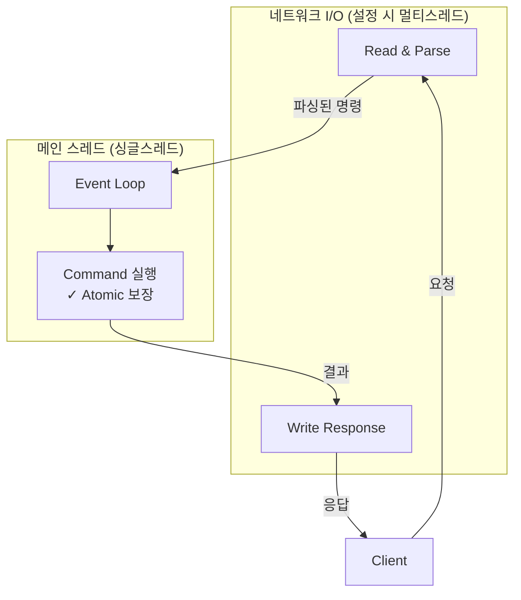

## 1. 들어가며

실무에서 Redis를 캐시, 분산락으로 사용하고 있다. 심지어 랭킹 시스템을 구현하면서 Redis ZSet 자료구조를 활용할 예정이다.
그런데 매번 Redis 기능을 가져다 쓰는 데만 집중했지, "Redis"는 무엇을 해결하기 위해 만들어졌고, 그 문제를 해결하기 위해 어떻게 동작할까에 대해 깊게 생각해본 적은 없었다.
이번 글에서는 Redis가 만들어진 이유와 동작 원리 등 본질에 대해 학습한 내용을 정리하였다.

## 2. Redis는 왜 만들어졌을까

2007년, 이탈리아 개발자 살바토레 산필리포는 **LLOOGG**라는 서비스를 운영하고 있었다. 웹사이트 방문자의 행동을 **실시간**으로 보여주는 로그 분석기였다.

문제는 **트래픽이 늘면서** 터졌다.

사용자가 페이지를 볼 때마다 DB에 쓰기 작업이 발생했다. 그리고 관리자 화면에서는 "최근 방문자 N명"을 실시간으로 보여줘야 했다. MySQL은 이 두 가지를 동시에 감당하지 못했다.

### 그래서 뭐가 필요했을까?

1. **빠른 쓰기** - 페이지뷰마다 지연 없이 기록
2. **"최근 N개" 빠른 조회** - 정렬된 데이터를 즉시 반환

디스크를 거치는 한 이 속도는 나올 수 없었다. 디스크는 물리적으로 느리다. 읽고 쓸 때마다 탐색 시간이 필요하고, 초당 수천 건의 요청을 실시간으로 처리하기엔 한계가 명확했다.

**답은 메모리였다.** 디스크보다 수만 배 빠른 메모리에서 직접 데이터를 처리하면 된다.

그래서 산필리포는 직접 만들기로 했다. 이름은 **Redis**, Remote Dictionary Server의 약자다.

2009년 6월, MySQL을 완전히 걷어내고 Redis로 교체. 이후 5년간 **20억 페이지뷰**를 월 $150짜리 VM 하나로 처리했다고 [전해진다](https://blog.brachiosoft.com/en/posts/redis/).

## 3. Redis는 어떻게 문제를 해결했을까

앞서 LLOOGG가 필요했던 건 "빠른 쓰기"와 "최근 N개 빠른 조회"였다.

### 3-1. 인메모리

**왜 디스크 기반 DB는 느렸을까?**

디스크는 데이터를 읽으려면 물리적으로 움직여야 한다. 원하는 위치로 헤드가 이동하고, 디스크가 회전해서 해당 섹터가 올 때까지 기다려야 한다.

**집에 두고 온 물건**과 같다. 필요할 때마다 집까지 다녀와야 한다.

**메모리는 뭐가 다른가?**

메모리는 물리적인 이동 없이, 주소만 알면 바로 접근할 수 있다.

**주머니에 있는 물건**과 같다. 필요하면 바로 꺼내면 된다.

결과적으로 메모리는 디스크보다 **1,000배 ~ 10만 배** 빠르다.

### 3-2. 단순한 Key-Value + 효율적인 자료구조

**Key-Value의 단순함**

RDBMS는 테이블, 인덱스, 조인 등 복잡한 구조를 거친다. 반면 Redis는 단순하다. Key를 주면 Value를 바로 돌려준다. 해시테이블 기반이라 `O(1)`, 상수 시간에 접근 가능하다.

**"최근 N개 조회"는 어떻게?**

DB로 하면 `ORDER BY timestamp DESC LIMIT N` 쿼리를 날려야 한다. 인덱스를 타더라도 쿼리 파싱, 옵티마이저, B-Tree 탐색 등 여러 단계를 거친다.

Redis의 ZSet(Sorted Set)은 다르다. 각 요소에 score(예: 타임스탬프)를 부여하면, **삽입 시점에 이미 정렬**된다. 내부적으로 스킵리스트를 사용해서 삽입, 삭제는 `O(log N)`. 범위 조회는 `O(log N + M)`인데, 시작 위치를 찾는 데 `O(log N)`, 거기서 M개를 순회하며 가져오는 데 `O(M)`이 걸린다. 메모리에서 바로 꺼내니까 디스크 I/O도 없다.

### 3-3. 싱글스레드 + I/O 멀티플렉싱

Redis 공식 문서에서는 이렇게 설명한다:

> "Redis is, mostly, a single-threaded server"

**"mostly"가 뭔가?**

| 구분 | 처리 방식 |
|------|-----------|
| **명령어 실행** | 싱글스레드 (메인 이벤트 루프) |
| **I/O 읽기/쓰기** | 멀티스레드 (Redis 6.0+, 설정 시) |
| **BGSAVE, AOF 재작성** | 자식 프로세스 (fork) |
| **UNLINK 등 비동기 삭제** | 백그라운드 스레드 |

핵심인 **명령어 실행은 싱글스레드**다. I/O나 백업 같은 부가 작업만 별도로 처리한다.

**왜 명령어 실행을 싱글스레드로?**

멀티스레드는 락 경쟁, 컨텍스트 스위칭 오버헤드가 생긴다. Redis 명령은 대부분 가벼워서 CPU가 병목이 아니다. 오히려 단순한 설계로 원자성을 보장하고, 동기화 오버헤드를 피하는 게 더 이득이다.

더 중요한 건, **싱글스레드라서 락이 필요 없다**는 점이다. 명령어가 순차적으로 실행되니까 `INCR`, `DECR` 같은 연산이 원자적으로 보장된다.

**그럼 동시 요청은 어떻게 처리하나?**

I/O 멀티플렉싱(`epoll`)을 사용한다.

일반적인 방식은 클라이언트마다 스레드를 할당하는 것이다. 하지만 이러면 10,000개 연결에 10,000개 스레드가 필요하고, 메모리와 컨텍스트 스위칭 비용이 커진다.

`epoll`은 Linux에서 제공하는 I/O 이벤트 알림 메커니즘이다. 하나의 스레드가 수천 개의 소켓을 등록해두고, **데이터가 준비된 소켓만** 알려준다. 준비 안 된 소켓은 건드리지 않으니 낭비가 없다.



Redis 6.0부터 네트워크 읽기/쓰기를 멀티스레드로 처리할 수 있다 (기본은 비활성화). 설정하면 처리량이 향상되지만, 명령 실행은 여전히 싱글스레드라서 Atomic이 보장된다.

## 4. 트레이드오프

**싱글스레드의 한계**

하나의 명령어가 오래 걸리면 전체가 블로킹된다. `KEYS *` 같은 O(N) 명령어를 프로덕션에서 호출하면 다른 모든 요청이 대기해야 한다. 그래서 `SCAN` 같은 점진적 명령어를 사용해야 한다.

```bash
redis-cli KEYS "user:*"                    # 1억 개의 키가 있으면 1억 개를 다 훑는다
redis-cli SCAN 0 MATCH "user:*" COUNT 100  # 커서 기반으로 100개씩 나눠서 조회한다.
```

**휘발성**

메모리 기반이라 별도 설정 없이는 서버 재시작 시 데이터가 사라진다. Redis는 이를 보완하는 두 가지 영속성 옵션을 제공한다:

- **RDB**: 특정 시점의 스냅샷을 디스크에 저장 (BGSAVE)
- **AOF**: 모든 쓰기 명령어를 로그로 기록

백업 작업은 메인 스레드에서 처리하면 전체가 멈추기 때문에, Redis는 `fork()`로 자식 프로세스를 생성해서 처리한다. Copy-on-Write 덕분에 자식 프로세스가 백업하는 동안 메인 스레드는 계속 명령어를 처리할 수 있다.

**용량 한계**

메모리는 디스크보다 비싸고 용량이 제한적이다. 게다가 Redis는 메모리 **파편화(fragmentation)** 문제가 있다. 데이터를 추가/삭제하다 보면 메모리가 조각나서 실제 사용량보다 더 많은 메모리를 점유하게 된다.

그래서 일반적으로 시스템 메모리의 **50~80%** 범위 내에서 관리하는 것이 권장된다. `maxmemory` 설정으로 상한을 걸고, 초과 시 eviction 정책(LRU, LFU 등)에 따라 오래된 키를 삭제하도록 설정할 수 있다.

## 5. 본질을 알면 판단이 쉬워진다

Redis의 동작 원리를 이해하면, 실무에서 마주치는 선택들이 자연스러워진다.

| 고민점 | 왜? (본질과 연결) |
|-------|------------------|
| Redis가 락처럼 동작할 수 있는 이유? | **싱글스레드**라서 `SETNX`가 원자적. 먼저 온 요청이 선점한다. |
| 랭킹 시스템에 Redis 쓰는 이유? | **싱글스레드**라서 `ZINCRBY`가 원자적. 1,000명이 동시에 +1해도 정확히 1,000점. |
| 큰 값 저장하지 말라는 이유? | **싱글스레드**라서 10MB 읽는 동안 전체 블로킹. |
| TTL 설정을 권장하는 이유? | **인메모리**라서 안 지우면 계속 쌓인다. 용량 한계에 주의. |

결국 "왜?"를 알면 "어떻게?"에 대한 답을 찾을 수 있는 것 같다.

## 6. 끝으로

Redis는 LLOOGG라는 실시간 로그 분석 서비스에서 "빠른 쓰기"와 "최근 N개 빠른 조회"라는 문제를 해결하기 위해 탄생했다. 

이 문제를 해결하기 위해 인메모리, 단순한 자료구조, 싱글스레드 + I/O 멀티플렉싱이라는 설계를 선택했고, 그 휘발성, 용량 한계, 블로킹 명령어를 고려해서 사용해야 한다.

Redis를 캐시, 분산락, 랭킹 등 다양한 곳에 사용하면서도 "왜 빠른지", "왜 싱글스레드인지"를 깊게 생각해본 적이 없었다. 이번에 탄생 배경부터 살펴보니, 어떻게 사용하는 것이 좋을지 자연스럽게 이해됐다.

앞으로는 단순히 "어떻게 쓰는가"를 넘어 "왜 필요하지?", "어떻게 동작하지?"를 파고드는 방향으로 학습해야겠다.

## 참고

**Redis 탄생 배경**
- [Redis - Wikipedia](https://en.wikipedia.org/wiki/Redis)
- [Redis GitHub Repository](https://github.com/redis/redis)
- [The History of Redis](https://blog.brachiosoft.com/en/posts/redis/)
- [개발바닥 - Redis 깊은 이야기](https://www.youtube.com/watch?v=Gimv7hroM8A)

**자료구조**
- [Redis Sorted Sets](https://redis.io/docs/latest/develop/data-types/sorted-sets/)
- [Redis ZADD Command](https://redis.io/docs/latest/commands/zadd/)

**싱글스레드 & I/O 멀티플렉싱**
- [The Engineering Wisdom Behind Redis's Single-Threaded Design](https://riferrei.com/the-engineering-wisdom-behind-rediss-single-threaded-design/)
- [Redis는 왜 싱글 스레드일까?](https://myvelop.tistory.com/266)
- [Redis 6.0 Threaded I/O를 알아보자](https://charsyam.wordpress.com/2020/05/05/%EC%9E%85-%EA%B0%9C%EB%B0%9C-redis-6-0-threadedio%EB%A5%BC-%EC%95%8C%EC%95%84%EB%B3%B4%EC%9E%90/)
- [Why Single-Threaded Redis is Lightning Fast](https://www.linkedin.com/pulse/why-heck-single-threaded-redis-lightning-fast-beyond-in-memory-kapur/)

**메모리 관리**
- [Google Cloud - Redis Memory Management Best Practices](https://cloud.google.com/memorystore/docs/redis/memory-management-best-practices)
- [Redis Memory Optimization](https://redis.io/docs/latest/operate/oss_and_stack/management/optimization/memory-optimization/)
