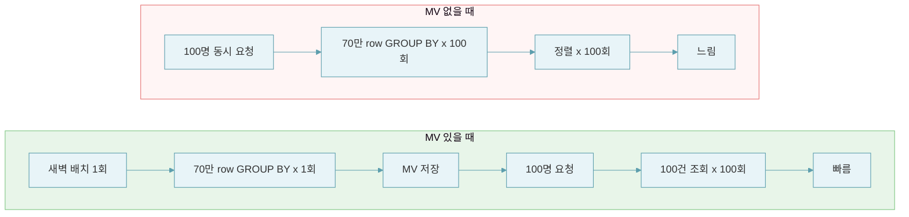

## 1. 들어가며

일간 랭킹은 Redis ZSet으로 간단히 구현할 수 있었다. 하지만 주간/월간 랭킹은 달랐다. 7/30일치 데이터가 쌓이면 수십만 건이 될 수 있고, 상품별로 점수를 합산하고 정렬해야 한다.

이번 글에서는 Spring Batch와 MV(Materialized View) 개념, 그리고 랭킹 순위를 미리 저장하려다 고생한 시행착오를 중점적으로 다루었다.

---

## 2. 왜 Spring Batch를 사용할까?

사내에서는 Spring Batch Job을 항상 `@Scheduled`와 함께 쓰고 있었다. 그래서 "배치 = 스케줄러"라고 생각했는데, 둘은 다른 개념이다.

- **스케줄러** (`@Scheduled`, Jenkins, CronJob): 언제 실행할지
- **배치 프레임워크** (Spring Batch): 어떻게 처리할지

Spring Batch 공식문서에서는 "대용량 레코드 처리를 위한 프레임워크"로 정의한다. 트랜잭션 관리, chunk 기반 처리, 재시도/스킵, 실행 이력 관리 기능을 제공한다.

### Chunk 기반 처리

Spring Batch 공식문서에서는 Chunk를 다음과 같이 정의한다.

> "Chunk-oriented processing refers to reading the data one at a time and creating 'chunks' that are written out within a transaction boundary."

데이터를 하나씩 읽어서 일정 개수(chunk)만큼 모으고, 그 단위로 트랜잭션을 커밋하는 방식이다.

왜 이게 필요할까? 다음 쿼리를 통해 알아보자.

```sql
INSERT INTO weekly_ranking (product_id, score)
SELECT product_id, SUM(weighted_score)
FROM daily_metrics
WHERE date BETWEEN '2024-01-01' AND '2024-01-07'
GROUP BY product_id;
```

100만 건을 처리하다가 중간에 예외가 발생하면? 처음부터 다시 돌려야 한다. 50만 건까지 처리했어도 롤백해야 한다.

Spring Batch는 이 문제를 **Chunk** 단위로 해결한다. 1000건씩 나눠서 처리하고, 각 chunk마다 커밋한다.

Step은 Reader → Processor → Writer 순서로 chunk 단위 처리를 수행한다.

```java
return new StepBuilder("rankingAggregationStep", jobRepository)
    .<AggregatedProductScore, ProductRankEntity>chunk(chunkSize, transactionManager)
    .reader(aggregatedScoreReader(period, baseDate))
    .processor(rankingProcessor())
    .writer(rankingWriter(period))
    .build();
```

Reader는 일별 데이터를 상품별로 집계한다.

```sql
SELECT new AggregatedProductScore(
    m.id.refProductId,
    SUM(m.viewCount),
    SUM(m.likeCount),
    SUM(m.salesCount)
)
FROM ProductMetrics m
WHERE m.id.metricDate BETWEEN :startDate AND :endDate
GROUP BY m.id.refProductId
ORDER BY m.id.refProductId
```

Processor는 가중치를 적용해서 점수를 계산한다.

```java
double score = item.calculateScore(viewWeight, likeWeight, orderWeight);
return WeeklyProductRank.of(item.refProductId(), yearWeek, score, ...);
```

Writer는 계산된 점수를 저장한다.

```java
weeklyRepository.saveAll(ranks);
```

중간에 실패해도 처리된 chunk는 유지된다. 그리고 Spring Batch는 실패 처리를 위한 기능도 제공한다.

- **트랜잭션 관리**: chunk 단위로 커밋되므로 실패 시 해당 chunk만 롤백된다.
- **재시도(Retry)**: 일시적인 오류(네트워크 타임아웃 등) 발생 시 지정한 횟수만큼 재시도할 수 있다.
- **스킵(Skip)**: 특정 예외 발생 시 해당 아이템을 건너뛰고 다음 아이템을 처리할 수 있다.

그리고 역할이 명확히 분리된다.

- **Reader**: 데이터 조회
- **Processor**: 데이터 가공
- **Writer**: 데이터 저장

---

## 3. MV(Materialized View)란?

조회 성능을 높이는 방법으로 인덱싱, Cache, MV 등이 있다. 그중 MV는 무엇일까?

> "A materialized view is a database object that contains the results of a query."
>
> — [Wikipedia](https://en.wikipedia.org/wiki/Materialized_view)

쿼리 결과를 미리 계산해서 저장해두는 개념이다. Oracle에서는 Materialized View라는 기능을 제공하지만, MySQL에서는 기본 기능으로 제공하지 않는다.
이번에 구현한 MV는 Oracle의 기능이 아니라 **개념적인 패턴**으로 복잡한 집계 결과를 별도 테이블에 저장해두고 조회하는 방식을 의미한다.

캐시와 비교했을 때 차이점은 무엇일까?

| 구분 | Cache | MV |
|------|-------|-----|
| 동작 방식 | 있으면 빠르고, 없으면 계산 | 항상 계산된 결과가 있음 |
| 적합한 경우 | 히트율이 높을 때 | 히트율이 낮을 때 |
| 갱신 시점 | 요청 시 또는 TTL 만료 시 | 배치로 정해진 주기에 |
| 집계 비용 | 작을 때 유리 | 클 때 유리 |

다만 MV는 원본 데이터가 변경되면 MV 테이블도 다시 갱신해야 한다는 점을 주의해야 한다. 실시간 반영이 필요한 경우에는 적합하지 않다.

주간/월간 랭킹을 집계할 때 MV는 어떻게 사용될 수 있을까?

```sql
-- 매번 이렇게 조회하면?
SELECT product_id, SUM(view_count * 0.1 + like_count * 0.3 + order_count * 0.6) as score
FROM daily_metrics
WHERE date BETWEEN @week_start AND @week_end
GROUP BY product_id
ORDER BY score DESC
    LIMIT 100;
```

7일치 데이터를 매번 합산하고 정렬해야 한다. 상품이 10만 개라면 70만 row를 GROUP BY하고 정렬해야 하는데, 100명이 동시에 조회하면 이 연산을 100번 반복해야 한다.

MV를 사용하면 계산은 한 번만 하면 된다.

```sql
-- 배치에서 미리 계산해서 저장
weekly_product_score
테이블:
| product_id | score   | period_start |
|------------|---------|--------------|
| 123        | 1523.5  | 2024-01-01   |
| 456        | 1498.2  | 2024-01-01   |

-- API에서는 단순 조회
SELECT *
FROM weekly_product_score
WHERE period_start = @current_week
ORDER BY score DESC LIMIT 100;
```

계산은 하루 한 번만 하고, 조회 시에는 저장된 데이터만 읽으면 되기 때문에 빠르게 응답할 수 있다.

상품 10만개, 7일치 데이터(70만 row), 동시 요청 100명일 때 MV가 있을 때와 없을 때를 비교해보자.



MV 없이 매 요청마다 집계하면 7천만 row를 스캔해야 하지만, MV를 사용하면 1만 row만 스캔하면 된다. DB 부하가 약 7000배 감소한다.

| 구분 | MV 없을 때 | MV 있을 때 |
|------|-----------|-----------|
| 집계 연산 | 요청마다 70만 row 집계 | 배치에서 70만 row 1회 집계 |
| DB 부하 | 100명 x 70만 = 7천만 row 스캔 | 100명 x 100건 = 1만 row 스캔 |
| 응답 속도 | 느림 | 빠름 (캐시 추가 시 더 개선 가능) |

---

## 4. MV에 랭킹 순위를 저장하려던 실수

처음에는 MV 테이블에 랭킹 순위(`rank_position`)까지 저장하려고 했다.

그런데 Spring Batch는 Reader에서 chunk 단위로 데이터를 나눠서 Processor로 넘긴다. 

Chunk 1에서 100위까지 처리했으면 Chunk 2는 101위부터 시작해야 한다. 문제는 **chunk는 서로 독립적이어서 이전 chunk가 몇 위까지 처리했는지 모른다**는 것이다. 순위를 저장하려면 chunk 간 상태 공유가 필요해지는데, 그러면 병렬 처리도 어렵고 재시도 시 순위가 꼬일 수 있다.

결국 점수만 저장하고, 랭킹 순위는 조회 시점에 계산하기로 했다.

```java
// 점수 기준 정렬 + 페이지네이션 조회
List<WeeklyProductRank> ranks = repository.findByYearWeekOrderByScoreDesc(yearWeek, page, size);

// 순위는 페이지 위치 기반으로 계산
int baseRank = page * size;
for (int i = 0; i < ranks.size(); i++) {
    int rank = baseRank + i + 1;  // 1위, 2위, 3위...
}
```

이렇게 하면 각 chunk는 독립적으로 점수만 저장하면 된다. chunk 간 상태 공유가 필요 없어지고, 병렬 처리도 가능해진다.

재시도가 필요한 경우에는 복합키 `(productId + yearWeek)`를 사용한 Upsert로 멱등성을 보장했다. 같은 상품의 같은 주차 데이터는 덮어쓰기 되므로, 배치를 재실행해도 멱등성이 보장된다.

```java
// 복합키: 상품 + 주차 → 같은 조합이면 UPDATE, 없으면 INSERT
@Entity
@IdClass(WeeklyProductRankId.class)
public class WeeklyProductRank {
    @Id private Long refProductId;
    @Id private String rankingYearWeek;  // "2024-W01"
    private Double score;
}

// 복합키 클래스
public class WeeklyProductRankId implements Serializable {
    private Long refProductId;
    private String rankingYearWeek;
}
```

---

## 5. 끝으로

순위를 저장하려다 막혔을 때, chunk 처리 방식을 제대로 이해하지 못한 것도 있었지만 근본적으로는 **저장할 데이터와 계산할 데이터를 구분하지 못한 것**이 문제였다.

데이터는 크게 두 가지로 나눌 수 있다.

- **원본 데이터**: 유저 시그널, 누적 수치 등. 정합성이 중요하다.
- **파생 데이터**: 원본에서 계산해낸 데이터. 다시 계산할 수 있다.

점수는 조회수/좋아요/주문수를 합산한 **파생 데이터**다. 순위는 점수에서 다시 파생된다. 파생 데이터를 저장하면 원본과의 동기화가 필요해지고, 저장하지 않으면 그 부담이 사라진다.

순위를 저장하지 않으면 chunk 간 상태 공유도 필요 없다. 점수가 계산되었으면 순위는 조회 시점에 점수 내림차순으로 정렬하면 된다. 결국 **"이 데이터를 꼭 저장해야 하는가?"**를 먼저 검토했어야 했다.

이번 학습을 통해 배운 Spring Batch와 MV 패턴은 실무의 병원 통계 코드 개선에도 적용해볼 수 있을 것 같다.

---

## 참고

- [Spring Batch Reference Documentation](https://docs.spring.io/spring-batch/reference/)
- [Materialized View - Wikipedia](https://en.wikipedia.org/wiki/Materialized_view)

