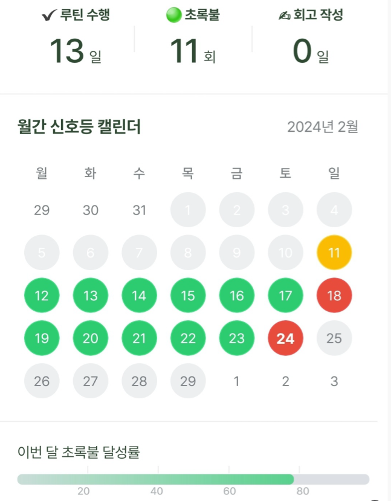

> 2023년 3월 크래프톤 정글 1기를 수료하고 거의 1년이란 시간이 지났다. 수료 후 취업 준비, 회사 적응 등의 핑계로 미루고 미뤄웠던 정글 후기와 2023년의 회고를 늦게나마 작성한다.

## 2023년 회고
2022년 10월, 크래프톤 정글 합격 소식을 듣자마자 2번째 회사 퇴사를 결심해 버렸다.

약 2년 6개월 동안 두 회사에서 네트워크 정보보안 시스템을 운영하면서 많은 관계사 담당자, 시스템 담당자분들과 일을 할 기회가 있었고 어떤 식으로 “**일**”을 하는지 배울 수 있는 시간이었다. 이 시간을 통해 나는 관리자 혹은 매니저보다 엔지니어가 되고 싶은 사람이라는 것을 깨닫게 되었다.

물론 회사에 다니며 개발자로 직무 전환을, 준비를 안해본 것은 아니다. 다만 안정적인 월급, 회식, 야근 등의 만들 수 있는 다양한 핑곗거리로 준비에 진척이 없었고, 그사이 취업 경쟁자들의 실력은 높아져만 갔다.

이런 상황에서 크래프톤 정글 합격 소식은 항상 머릿속으로만 “개발자가 될 거야!” 라는 생각을 제대로 실행에 옮기는 첫 **출발**이었다.
### 정글에서는
#### 입소전
금요일 퇴사 후 바로 그 다음주  월요일에 기숙사에 입소하였다. 입소 후 바로 2박3일동안 미니 프로젝트를 할 것을 알고 있었기에 다른 팀원들에게 민폐가 되지 않도록 입소 시험을 복기하며 조금 긴장을 하며 지냈었다.
#### 입소 후
입소 후 얼마 지나지 않은 10월 어느 날, 입소 동기 형들과 함께 선선한 가을 공기를 마시며 “**크래프톤 정글 5개월 과정이 진짜 끝나긴 할까**?”라는 이야기했던 것이 가장 기억에 남는다. 지금에서야 되돌아보면 5개월이라는 시간이 너무나 빠르게 흘렀다. 군대를 다녀온 사람이라면 군대 시절을 회상하면 될 듯하다.

5개월 동안 같이 지낼 같은 반 동기들 모두 각자의 개성과 무기가 있었다. 나는 컴퓨터 공학을 전공하였고 정보보안 업무 경험이 있었기 때문에 처음 개발을 접하는 분들보다 그나마 정글 커리큘럼에 적응을 빨리할 수 있었다. 하지만 다들 자신만의 무기로 하루가 다르게 성장하는 모습을 보면서 나는 개발적으로 뛰어난 사람이 전혀 아니 구나를 많이 느꼈다.
뭐 억지로라도 나만의 무기를 찾자면 **배운 것을 기록**하고 **뭐든 배우려고 하는 마인드**이라고 말할 수 있겠다.

> 정글에서 학습을 어떻게 했는지는 따로 글을 쓰는 편이 좋을 것 같다. 당연히 “정글을 이렇게 보냈구나, 뭐 이렇게 해보는 건 나에게 도움이 될 듯한데?” 정도로만 참고해 주시면 좋겠다.

### 취업
> 어?  개발자 취업 빡센데?

카이스트 정글 수료 후기를 통해 흔히 말하는 이름있고 좋은 회사에 취업하신 분들이 꽤 있다는 것을 알게 되었다. 또 크래프톤 정글 1기이기도 하고 협력사도 많으니까 어떻게든 취업이 바로 되지 않을까? 라고 바보 같이 생각했다. 현재 취업 시장이 힘든 건 누구나 알고 있는 사실이니까 거두절미하겠다. 나의 경우 컴퓨터 공학 전공자 + 관련 직종 업무 경험은 면접관의 높은 기대와 판단 기준이 되었고, 나는 기대를 만족시키지 못했다.

**취업 기간**은 23년 3월 수료 후 23년 9월 중순에 JAVA, Vue 언어를 사용하는 스타트업에서 개발자 커리어를 시작하게 되었다. 이 기간에 개인 프로젝트 1개, CS, 알고리즘, 면접 준비, 해커톤 참여(당일치기), 블로그 정도를 하였다. 면접이 잡혀있다면 당연히 면접에 집중하고, 코테가 주말에 있다면 코테 공부를 더 집중적으로 하였다. 보통은 코딩테스트에 2~3시간, 개인 프로젝트 4~6시간, 나머지 시간을 당장 필요한 보완점 보충하는 데 시간을 보냈다.

서류는 약 150건 정도 지원을 하였고 협력사 지원에서는 최종까지 가서 대표님 앞에서 라이브 코테를 바보같이 말아먹은 적도 있고, 면접에서는 친구가 많으세요? 라는 기가막힌 질문을 듣기도 하였다.

8월엔 두 회사에 합격하였고, 고심 끝에 한 스타트업을 선택하였으나 연봉 협상 과정에서 600만 원을 내려 입사를 포기하였고 결국 취업에 실패했다. 이것이 분노의 지원 러쉬 계기가 되었고 한 주에 4회 면접을 보게 되었다. 잘하지 못하는 편이지만 그래도 하면 나아진 다는 것을 느꼈다. 2번의 면접을 말아먹고 3번째 면접에서 준비를 철저히 하여 자바 개발자로서 자바 성장할 수 있는 회사에 입사하게 되었다. 이런 경험을 하며 **"취업은 운이다"** 라는 말을 몸소 느낄 수 있었다.

#### 취업 스터디
약 6개월 동안 백엔드 취업 스터디, 윕 개발 취준생 포트폴리오 스터디, 취준 컴퍼니 등 다양한 활동에 참여하여 취업 정보를 얻고, 동기부여를 받고, 멘탈 케어를 했다.
취업이 길어지는 이유는 내가 못 해서 일 수도 있지만, 진짜 운이 좋지 않아서 일 수도 있다. 스터디원 모두 “이 사람이 왜 취업이 안 돼?” 라는 능력자들이었고, 결국 4명 중 3명은 현재 취업에 성공하였다. (+ 1분은 꽤 유명한 회사!)

[SOUP](https://soup.pw/) 라는 사이트에서 OKKY나 인프런 등에서 사람들이 올리는 다양한 스터디 모집 글을 한꺼번에 볼 수 있다. 지금은 주 1회 블로그 업로드 스터디에 참여하여 나에게 강제성을 부여하고 있다.

그래도 마음이 불안할 때면 운동을 했다. 운동할 시간도 사치다 싶으면 자전거로 배민 커넥터를 두 시간 정도 달렸다. 밥값도 벌고 스트레스도 풀려 나에겐 이 방법이 꽤 괜찮았었다.

### 회사
우선 개발자 중 내가 나이가 제일 많다. 전 직장은 사수분과 20살 차이가 났었다. 역시 스타트업은 젊고 모든 게 빠르게 변한다. 결제와 보고서 작성이 일상이었던 이전 직장과 분위기가 너무나 달라 적응하는 데 조금 시간이 걸렸지만 뭐 정글처럼 어떻게든 다 적응한다. 그리고 퇴근 후 업무 메신저 지옥은 없어 공/사가 분리되는 것은 나에게 큰 장점이다.

동료분들은 자신의 업무에 책임감을 가지고 있고, 개발자로서 성장하려고 하는 모습이 너무나도 눈에 잘 보인다. 정글에서 5개월간 합숙하며 나도 나름 허슬러가 되었다고 생각했지만, 여기서는 내가 게으른 편인 것 같다.

그리고 나는 제대로 이해가 안 되면 쉽게 개발을 시작하지 못하는 편인데, 모르는 것을 막 물어봐도 친절히 알려주시는 좋은 개발자분들이 많다. ~~요즘은 동료분들의 업무 집중을 위해 질문을 자제하려고 노력하고 있다.~~

왜 다들 좋은 동료가 있는 회사를 가고 싶어 하는지 깨달았다. 더 좋은 서비스를 만들기 위한 목표를 달성하기 위해 같이 고민할 수 있는 믿을 수 있는 동료가 많다는 것은 꽤 심적으로 안정된다. 야근은 많지만, 내 실력을 향상하는 것으로 생각하니 그렇게 힘들진 않다. 벌써 6개월 차인데, 조금 더 성장에 속도를 낼 수 있도록 어떤 것을 해야할지 항상 고민이 된다.
## 2024년 목표
### 개발 문서
회사에서 프로젝트를 진행하면서 외부 협력사와 협업하는 일이 많다. 개발에 대해 내가 이해하는 것을 전달하는 과정에서 미스 커뮤니케이션이 일어나는 경우가 종종 있어 CTO께서 말을 재전달 해주는 일이 가끔 있었다. 이런 미스 커뮤니케이션 상황을 줄이고 개발 진행, 테스트 상황을 외부와 적극적으로 공유하고자 관련 문서를 작성하였고 컨플루언스에 초대하였다.

이 과정에서 테스트 관련 문서를 잘 작성했다라는 과분한 칭찬을 받았는데, 정글에서 느낀 나만의 무기도 그렇고 체계적이고 효율적으로 개발 문서화 하는 것을 **나만의 무기로 삼으면 어떨까?** 라는 생각이 요즘 들고 있다.

회사에서도 동료분들과 개발 문서를 더 체계적이고 효율적으로 공유할 수 없을까를 고민하고 이를 주제로 3월에 세미나 발표를 할 예정이다. 1년 동안 개발 문서화에 대해 공부를 하고 바로 적용해 봄으로써 어떤 좋은 점이 있는지 눈으로 확인해 보고 싶어졌다.

### 독서
롤모델로 삼고 싶은 회사 동료분께서 매일 잠들기 전 30분 독서를 하고, 올해 목표는 나이만큼 책을 읽는 목표를 세우셨다. 이 이야기를 듣고 나는 나의 성장을 위해 언제 책을 읽었지? 라는 물음이 머릿속에 스쳐 지나갔다.

이제라도 좋은 건 따라 하자. 2주 정도 진행했고 책 1권을 읽었다.앞으로 남은 매일 초록 불을 켤 수 있도록 노력할 것이다.

### 인강
이 목표도 롤모델로 삼고 싶은 분이 퇴근 후 김영한님 강의을 보고 회사에 적용하여 실력을 향상했다는 이야기를 듣고 세운 것이다.
올해 안에 아직 수강하지 않은 김영한님 자바 관련 강의와 테스트 코드 강의 수강을 완료하고, 회사에 적용할 수 있는 것은 적용하며 블로그에 글을 남길 것이다.
추가로 올해는 JPA와 테스트 코드를 개인 프로젝트 or 사이드 프로젝트에 꼭 활용 해 볼 것이다.

